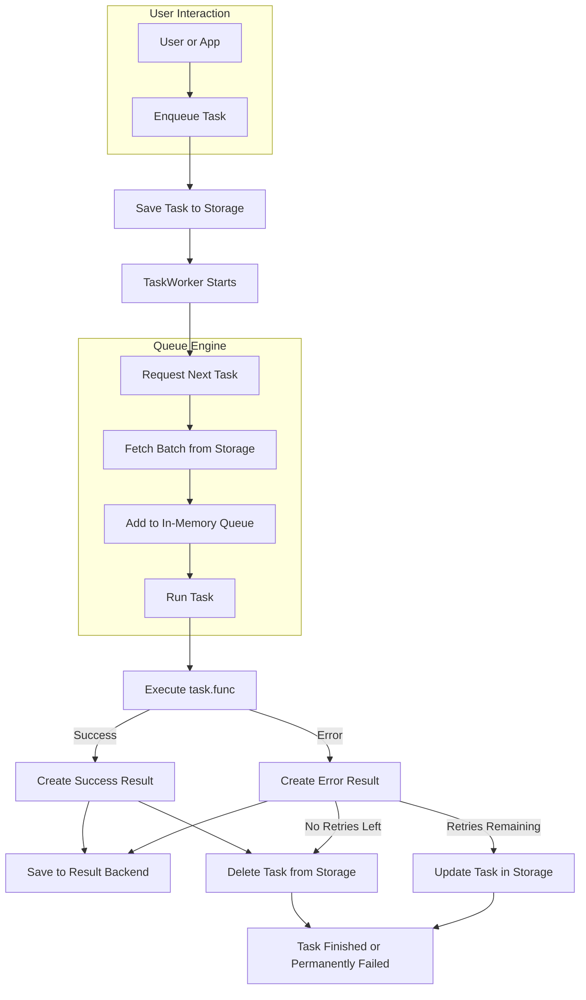

# Looplane

> ⚠️ This project is in early development and not yet production-ready.

**Looplane** is an experimental asynchronous task queue for Python, focused on simplicity and local-first execution.  
It combines an in-memory queue with optional persistent storage using [LMDB](https://github.com/LMDB/lmdb), enabling basic task durability without the need for external services like Redis or RabbitMQ.

---

## ✨ Features

- 🌀 Async-first task queue using `asyncio`
- 💾 Optional local persistence via LMDB
- 🧠 Decorator-based task registration
- 🔁 Built-in retry and timeout support
- ⚙️ Pluggable storage backends

---
## 📦 Components

- **TaskQueue**: Pulls and dispatches tasks from storage to execution.
- **TaskWorker**: Processes tasks and handles retries/failures.
- **Storage Backend**: Manages pending tasks.
- **Result Backend**: Persists task results (success or failure).

---
## 🧩 Architecture Overview (WIP)

This diagram shows the current design of the task processing system. It serves as a utility to help developers and contributors quickly understand how the main components interact.



---

## 🚧 Status

Looplane is currently **experimental** and intended for learning, exploration, or internal tooling.  
We don't recommend it for production use — yet.

If you want to contribute, test ideas, or explore local async queues, you're more than welcome!

---

## 🔧 Quickstart

```bash
# Clone the repo
git clone https://github.com/your-username/looplane.git
cd looplane

# Install dependencies
poetry install

# Run the example
make run-example
```

## 🧪 Example
```python
from looplane.task import register_task

@register_task
async def say_hello(name: str):
    print(f"Hello, {name}!")

# Enqueue it
await queue.enqueue(say_hello, "world", retries=2)
```

---

## 📦 Roadmap (WIP)
- Result persistence
- Prioritized task queue
- Web UI dashboard (FastAPI + Tailwind)
- More storage backends (SQLite, JSONL)
- Result persistence and inspection
- CLI tool to enqueue tasks, inspect queue, view errors
- Support for gRPC-based client/worker communication
- Plugin system for storage backends
- Retry backoff strategy
- Task metrics and instrumentation
- DAG-style pipeline execution and orchestration

---
## 📝 License
This project is licensed under the MIT License.
Feel free to fork, experiment, and build on it.

---
## 🤝 Contributing
Contributions, ideas, and feedback are welcome!
Open an issue or PR to start a discussion.
